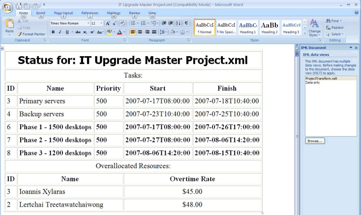

# How to: Use XSLT Transformations with Project XML Data Interchange Files


The Extensible Stylesheet Language Transformation (XSLT) standard specifies a language definition for XML data transformations. XSLT is used to transform XML documents into XHTML documents, or into other XML documents. This article shows you how to use XSLT with Microsoft Office Project 2007 XML Data Interchange files to filter and display project information. (The content of this article was contributed by Jessica Britton, Microsoft Corporation.)

> [!NOTE]
> For information about saving projects as Project XML Data Interchange files, see <A href="saving-and-opening-projects-in-xml-format.md">Saving and Opening Projects in XML Format</A>.

An XSLT stylesheet is an XML document that consists of a combination of XHTML markup, XSLT template rules, and XPath statements that work together.

  - XHTML markup defines the display environment that XML data is presented in.

  - XSLT template rules provide instructions for transforming a source XML element in a particular way.

  - XPath statements identify specific elements within an XML document.

When an XML element matches an XPath pattern, the associated XSLT template rule is invoked. The transformed data is then rendered in the display framework specified by the XHTML markup.

For more information about XSLT template rules and XPath statements, see the links at the end of this article.

## Displaying Project Information by using XSLT Transformations

### Procedure 1. To create an XSLT stylesheet:

1.  Create an XSLT file for your stylesheet. If you are working in Microsoft Visual Studio 2005, you can use the **XSLT File** template (in Visual Studio, click **File**, point to **New**, and then click **File**. This template is prepopulated with the XML code shown in the following example. If you are working in another text or XML editor, copy this template XML and then paste it into your XSLT file.
    
    ``` xml
    <?xml version="1.0" encoding="utf-8"?>
    
    <xsl:stylesheet version="1.0"
        xmlns:xsl="http://www.w3.org/1999/XSL/Transform">
    
    <xsl:template match="/">
        <html>
        <body>
        <!--
            This is an XSLT template file. Fill in this area with the
            XSL elements which will transform your XML to XHTML.
        -->
        </body>
        </html>
    </xsl:template>
    
    </xsl:stylesheet>
    ```

2.  Delete the following XML code comment. This is where you write your XSLT code.
    
    ``` xml
        <!--
            This is an XSLT template file. Fill in this area with the
            XSL elements that will transform your XML to XHTML.
        -->
    ```

3.  Create your XSLT code. The XSLT code shown in this example does the following:
    
      - Displays the text value of the Name child of the Project element in a header.
    
      - Tests the Summary child of each Task element to see if the value is 0 (false).
    
      - Tests the Critical child of each Task element to see if the value is 1 (true).
    
      - Displays data for critical tasks that are not summary tasks in bold.
    
      - Displays data for noncritical tasks that are not summary tasks.
    
      - Sorts resource information alphabetically by the text value of the Name child of each Resource element.
    
      - Tests the Overallocated child of each Resource element to see if the value is 1 (true).
    
      - Displays sorted resource data for only overallocated resources.
    
    <!-- end list -->
    
    ``` xml
    <!-- Define a table to display data in. -->
          <table border="1" cellpadding="3">
            <tr>
              <td colspan="5" align="center">
                <!-- Filter for the project name and display it in a header.  -->
                <h2>
                  <font face="tahoma" size="5">
                    Status for: <xsl:value-of select="Project/Name" />
                  </font>
                </h2>
              </td>
            </tr>
            <!-- Define headers for task information. -->
            <tr>
              <td colspan="5" align="center">
                Tasks:
              </td>
            </tr>
            <tr>
              <th>
                <font color="black">ID</font>
              </th>
              <th>
                <font color="black">Name</font>
              </th>
              <th>
                <font color="black">Priority</font>
              </th>
              <th>
                <font color="black">Start</font>
              </th>
              <th>
                <font color="black">Finish</font>
              </th>
            </tr>
            <!-- Filter for tasks -->
            <xsl:for-each select="Project/Tasks/Task">
              <!-- Exclude summary tasks -->
              <xsl:if test="Summary[.=0]">
                <xsl:choose>
                  <!-- Display information for critical tasks with a colored background. -->
                  <xsl:when test="Critical[.=1]">
                    <tr>
                      <td>
                        <xsl:value-of select="ID"/>
                      </td>
                      <td>
                        <b>
                          <xsl:value-of select="Name"/>
                        </b>
                      </td>
                      <td>
                        <b>
                          <xsl:value-of select="Priority"/>
                        </b>
                      </td>
                      <td>
                        <b>
                          <xsl:value-of select="Start"/>
                        </b>
                      </td>
                      <td>
                        <b>
                          <xsl:value-of select="Finish"/>
                        </b>
                      </td>
                    </tr>
                  </xsl:when>
                  <!-- Display information for noncritical tasks with a white background. -->
                  <xsl:otherwise>
                    <tr>
                      <td>
                        <xsl:value-of select="ID"/>
                      </td>
                      <td>
                        <xsl:value-of select="Name"/>
                      </td>
                      <td>
                        <xsl:value-of select="Priority"/>
                      </td>
                      <td>
                        <xsl:value-of select="Start"/>
                      </td>
                      <td>
                        <xsl:value-of select="Finish"/>
                      </td>
                    </tr>
                  </xsl:otherwise>
                </xsl:choose>
              </xsl:if>
            </xsl:for-each>
            <!-- Define headers for overallocated resource information. -->
            <tr>
              <td colspan="5" align="center">
                Overallocated Resources:
              </td>
            </tr>
            <tr>
              <th>
                <font color="black">ID</font>
              </th>
              <th colspan="2">
                <font color="black">Name</font>
              </th>
              <th colspan="2">
                <font color="black">Overtime Rate</font>
              </th>
            </tr>
            <!-- Filter for resources -->
            <xsl:for-each select="Project/Resources/Resource">
              <!-- Sort resources alphabetically by name -->
              <xsl:sort select="Name" />
              <!-- Display information for only resources that are overallocated. -->
              <xsl:if test="OverAllocated[.=1]">
                <tr>
                  <td>
                    <xsl:value-of select="ID"/>
                  </td>
                  <td  colspan="2">
                    <xsl:value-of select="Name"/>
                  </td>
                  <td  colspan="2" align="center">
                    $<xsl:value-of select="OvertimeRate"/>.00
                  </td>
                </tr>
              </xsl:if>
            </xsl:for-each>
          </table>
    ```

4.  Save the file as ProjectTransform.xslt.

After you create the XSLT stylesheet, you must link your Project XML file to it by adding processing instructions. Procedure 2 shows you how to link the ProjectTransform.xslt file created in Procedure 1 to any Project XML file.

### Procedure 2. To modify the Project XML file to use the XSLT stylesheet:

1.  Open a Project XML file in Visual Studio, or in another text or XML editor.

2.  Insert the following line of code after the XML declaration, which is the first line in the Project XML file.
    
    ``` xml
    <?xml-stylesheet type="text/xsl" href="ProjectTransform.xslt"?>
    ```

3.  Delete the XML namespace declaration from inside the Project element, which is the root element of the Project XML file. If you do not delete the namespace declaration that is embedded in the Project element, XPath statements will fail to match elements in the Project XML file.
    
    After you perform Steps 2 and 3, the first three lines of your Project XML file should look like the following code example.
    
    ``` xml
    <?xml version="1.0" encoding="UTF-8" standalone="yes"?>
    <?xml-stylesheet type="text/xsl" href=" ProjectTransform.xslt"?>
    <Project>
    ```

4.  Save the Project XML file.
    
    > [!NOTE]
    > We recommend you save the file by using a file name that is different from the original Project XML file name, because the changes made in Step 3 disassociate the Project XML file from the Project XML Data Interchange Schema.

5.  View the transformed Project XML file. You can perform the XSLT transformation in Visual Studio by setting the **Stylesheet** property of the Project XML file to ProjectTransform.xslt, and then selecting **Show XSLT Output** from the **XML** menu.
    
    You can also open the Project XML file in Internet Explorer 7, Microsoft Office Word 2007, or any other application that supports XSLT.

Figure 1 shows the transformed output of a Project XML file in Word 2007. When you open the Project XML file, by default the **Data only** data view is displayed. To see the transformed output you must select the **ProjectTransform.xslt** data view in the **XML Document** pane.

Figure 1. Transformed Project XML file



## See also

- [Saving and Opening Projects in XML Format](saving-and-opening-projects-in-xml-format.md)

- [What is XSLT?](http://msdn2.microsoft.com/en-us/library/ms759096.aspx)

- [XSLT Reference](http://msdn2.microsoft.com/en-us/library/ms256069.aspx)

- [XPath Reference](http://msdn2.microsoft.com/en-us/library/ms256115.aspx)

