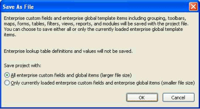

# Saving and Opening Projects in XML Format

The Microsoft Office Project 2007 XML Data Interchange Schema (mspdi\_pj12.xsd) defines how Project 2007 reads and writes project data in XML format. This article describes how to work with Project 2007 XML Data Interchange files, and contains the following sections:

  - Saving Project Files as XML

  - Opening Project XML Files

## Saving Project Files as XML

In Project Standard 2007 and Project Professional 2007, you can save any project as a Project XML Data Interchange file. The steps in Procedure 1 applies to Project Professional.

Project data stored in Project XML files can be filtered and displayed by using XSLT transformations. For more information, see [How to: Use XSLT Transformations with Project XML Data Interchange Files](how-to-use-xslt-transformations-with-project-xml-data-interchange-files.md).

### Procedure 1. To save a project file as XML using Project Professional

1. In Project Professional, on the **File** menu, click **Save As**.

2. In the **Save to Project Server** dialog box (Figure 1), click **Save as File**.
    
    > [!NOTE]
    > If you are working with Project Professional 2007 in a stand-alone environment, you will not be presented with the <STRONG>Save to Project Server</STRONG> dialog box (Figure 1) or the <STRONG>Save As File</STRONG> dialog box (Figure 2). You will see only the <STRONG>Save As</STRONG> dialog box.
        
    Figure 1. Save to Project Server dialog box
          
    

3.  In the **Save As File** dialog box, you can save the file with only the currently loaded enterprise items, or with all enterprise items. Selecting the option to save only the currently loaded enterprise items can result in a smaller file depending on the configuration of your project.
    
    After you select an option, click **OK**.
    
    Figure 2. Save As File dialog box
     
    

4.  In the **Save As** dialog box, browse to the location where you want to save the file.

5.  In the **Save as type** list, manually select **XML Format (\*.xml)**, and then click **Save**. If you do not select the \*.xml option, the project is saved using the default Project file format (.mpp).

## Opening Project XML Files

Any valid Project 2007 XML Data Interchange file can be opened by Project Standard 2007 and Project Professional 2007. Project Standard ignores XML data that applies only to enterprise projects. After you open a Project XML file, it behaves as any other project.

### Procedure 2. To open a Project XML file

1.  In Project Professional 2007, on the **File** menu, click **Open.**
    
    > [!NOTE]
    > You can also open a Project XML file by browsing to the file by using a Windows Explorer window, right-clicking the file, and then selecting <STRONG>Microsoft Office Project</STRONG> on the <STRONG>Open with</STRONG> menu. If you use this method to open a Project XML file, you immediately see the <STRONG>Import Wizard</STRONG>, as shown in Figure 4.

2.  In the **Open** dialog box (Figure 3), select an option in the **Look in:** pane that is displayed on the left of the **Open** dialog box (for example, **My Documents**), and browse to the location of the XML file you want to open.
    
    > [!NOTE]
    > You must manually select <STRONG>XML Format (*.xml)</STRONG> or <STRONG>All Files (*.*)</STRONG> in the <STRONG>Files of type</STRONG> list to display XML files in the <STRONG>Open</STRONG> dialog box. Figure 3 shows the Open dialog box in Project Professional.

    Select the XML file you want to open, and click the **Open** button. You can also simply double-click the XML file.
    
    Figure 3. Open Dialog Box
    
    

3.  The **Import Wizard** starts (Figure 4).
    
    Figure 4. Import Wizard
    
    
    
    Select how you want to import the XML file, and then click **Finish**:
    
      - **As a new project**  Creates a new project from the XML file.
    
      - **Append the data to the active project**  Appends the project data in the XML file to the existing project that is currently active in Project Professional.
        
        When Project 2007 appends XML data to an existing project, the unique ID of the appended summary task is incremented from 0 to the next available integer. For example, if the project to which you are appending XML data has three tasks with the unique IDs 1, 2, and 3, the appended summary task is given the unique ID of 4. Project then increments the unique IDs of all tasks in the appended project. Using the same example, tasks 1 and 2 of the appended project are assigned the next available unique IDs, 5 and 6.
        
        > [!NOTE]
        > This process can disassociate assignments, tasks, resources, and cross-project links from original data. To help ensure that data is not disassociated, separate this data into its smallest possible component: a task, a resource, an assignment, and so on, before appending.

      - **Merge the data into the active project**  Merges the project data in the XML file into the project that is currently active in Project Professional.
        
        When Project 2007 merges XML data to an existing project, tasks in the project file that are currently active in Project Professional are overwritten by tasks in the XML file that share the same unique ID.
        
        > [!NOTE]
        > Use caution when merging a XML data into an active project, as this process can result in data loss.

        If the XML file is invalid according to the Project 2007 XML Data Interchange Schema (mspdi\_pj12.xsd), Project shows an error message, as shown in Figure 5.
        
        Figure 5. Project error message
         
        

## See also

- [How to: Use XSLT Transformations with Project XML Data Interchange Files](how-to-use-xslt-transformations-with-project-xml-data-interchange-files.md)

- [Introduction to Project XML Data](introduction-to-project-xml-data.md)

- [Custom Field Data in XML](custom-field-data-in-xml.md)

- [Project Data Interchange Elements](project-data-interchange-elements.md)

